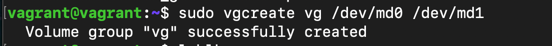

### 1.Узнайте о sparse (разряженных) файлах.
>Разрежённый файл (англ. sparse file) — файл, в котором последовательности нулевых байтов[1] заменены на информацию об этих последовательностях (список дыр).

>Дыра (англ. hole) — последовательность нулевых байт внутри файла, не записанная на диск. Информация о дырах (смещение от начала файла в байтах и количество байт) хранится в метаданных ФС.  
### 2. Могут ли файлы, являющиеся жесткой ссылкой на один объект, иметь разные права доступа и владельца? Почему?

> Нет, потому что hardlink на тот же файл имеет тот же inode и права будут одни и те.
> 
### 3. Сделайте vagrant destroy на имеющийся инстанс Ubuntu. Замените содержимое Vagrantfile следующим:  
Данная конфигурация создаст новую виртуальную машину с двумя дополнительными неразмеченными дисками по 2.5 Гб.  
> так как у меня виртуализация на Parallels Desktop, то конфиг Vagrant у меня выглядит по другому:    
>   
> получаем два диска по 2,5
> 
### 4.Используя fdisk, разбейте первый диск на 2 раздела: 2 Гб, оставшееся пространство.
> 
### 5.Используя sfdisk, перенесите данную таблицу разделов на второй диск.
>
### 6.Соберите mdadm RAID1 на паре разделов 2 Гб.
>
### 7. Соберите mdadm RAID0 на второй паре маленьких разделов.
>
### 8.Создайте 2 независимых PV на получившихся md-устройствах.
>
### 9. Создайте общую volume-group на этих двух PV.
>
>
### 10.Создайте LV размером 100 Мб, указав его расположение на PV с RAID0.
>
>
### 11.Создайте mkfs.ext4 ФС на получившемся LV.
>
>
### 12.Смонтируйте этот раздел в любую директорию, например, /tmp/new
>mount /dev/vg/lvol0 /tmp/new/  
>
### 13.Поместите туда тестовый файл, например wget https://mirror.yandex.ru/ubuntu/ls-lR.gz -O /tmp/new/test.gz
>
### 14. Прикрепите вывод lsblk 
>
### 15. Протестируйте целостность файла:  
>root@vagrant:~# gzip -t /tmp/new/test.gz  
>root@vagrant:~# echo $?  
0  
> 
>> 
### 16. Используя pvmove, переместите содержимое PV с RAID0 на RAID1.
>
### 17. Сделайте --fail на устройство в вашем RAID1 md.
>
### 18.Подтвердите выводом dmesg, что RAID1 работает в деградированном состоянии.
>
### 19. Протестируйте целостность файла, несмотря на "сбойный" диск он должен продолжать быть доступен:  
> root@vagrant:~# gzip -t /tmp/new/test.gz  
root@vagrant:~# echo $?  
0
> 
>>Доступен) рейд 1 сделал свое дело   

