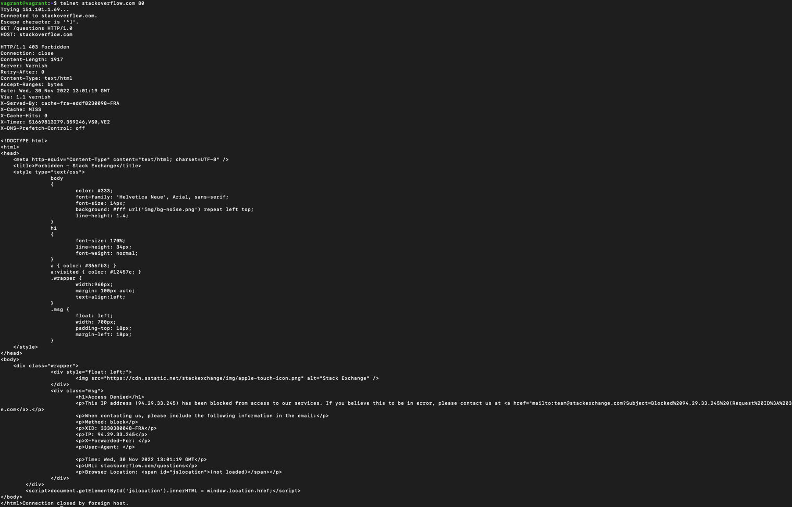
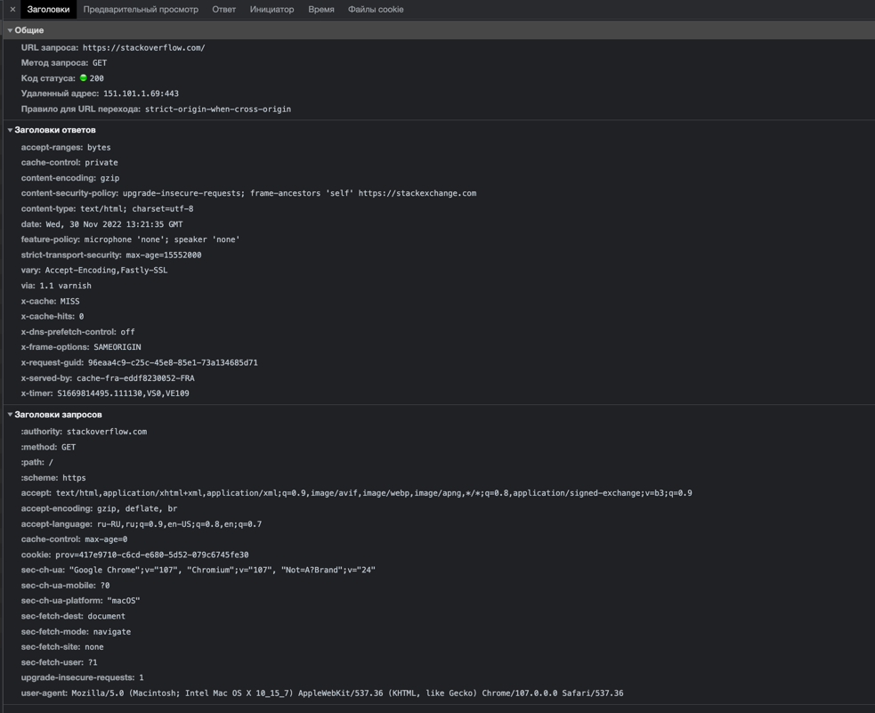
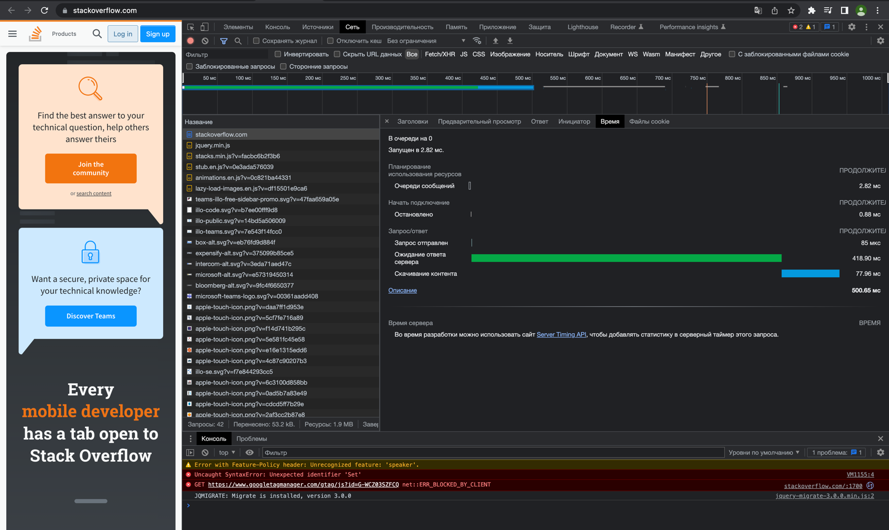
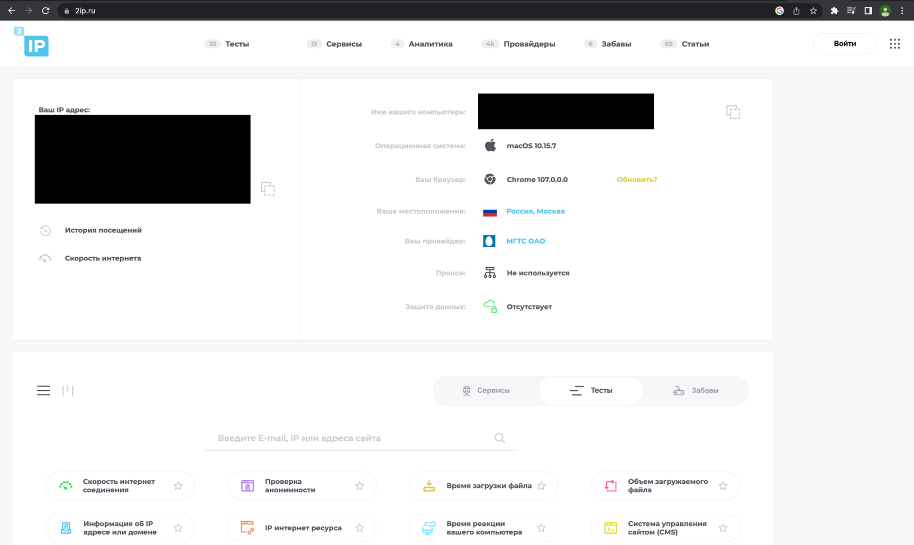
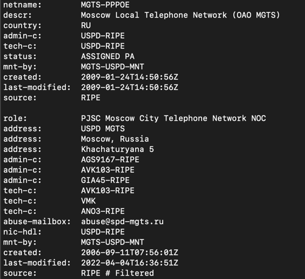
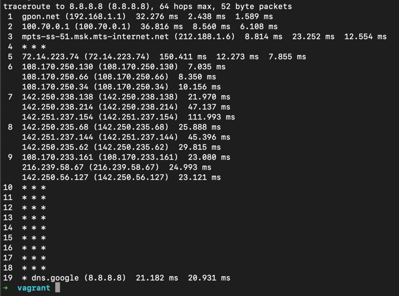
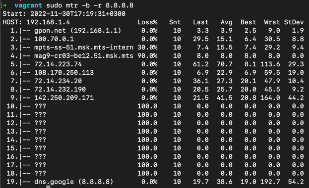
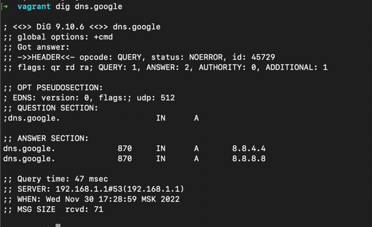
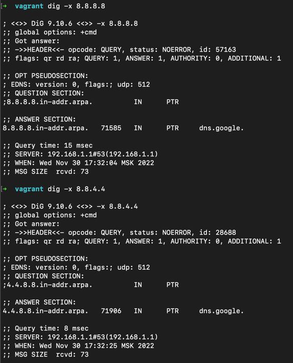

### 1. Работа c HTTP через телнет.
Подключитесь утилитой телнет к сайту stackoverflow.com telnet stackoverflow.com 80  
Отправьте HTTP запрос  
>GET /questions HTTP/1.0  
HOST: stackoverflow.com  
[press enter]  
[press enter]  

> 
### 2. Повторите задание 1 в браузере, используя консоль разработчика F12.

> 
> 
### 3. Какой IP адрес у вас в интернете?
> 
### 4. Какому провайдеру принадлежит ваш IP адрес? Какой автономной системе AS? Воспользуйтесь утилитой whois
whois ip
>   
> origin:         AS25513
### 5.Через какие сети проходит пакет, отправленный с вашего компьютера на адрес 8.8.8.8? Через какие AS? Воспользуйтесь утилитой traceroute
>
### 6. Повторите задание 5 в утилите mtr. На каком участке наибольшая задержка - delay?
>
### 7. Какие DNS сервера отвечают за доменное имя dns.google? Какие A записи? Воспользуйтесь утилитой dig
>
### 8. Проверьте PTR записи для IP адресов из задания 7. Какое доменное имя привязано к IP? Воспользуйтесь утилитой dig
> 