### 1. Подключитесь к публичному маршрутизатору в интернет. Найдите маршрут к вашему публичному IP
> 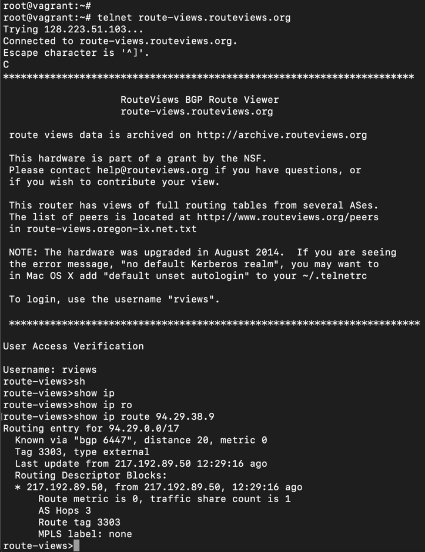  
> вывод слишком длинный вставил только кусок  
> 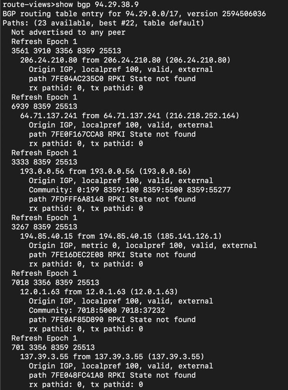
### 2. Создайте dummy0 интерфейс в Ubuntu. Добавьте несколько статических маршрутов. Проверьте таблицу маршрутизации.
> - 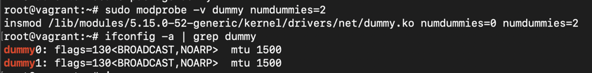
> - 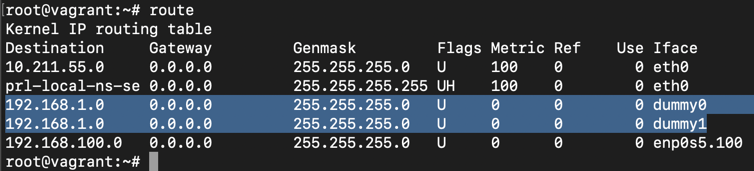
### 3.Проверьте открытые TCP порты в Ubuntu, какие протоколы и приложения используют эти порты? Приведите несколько примеров.
> - 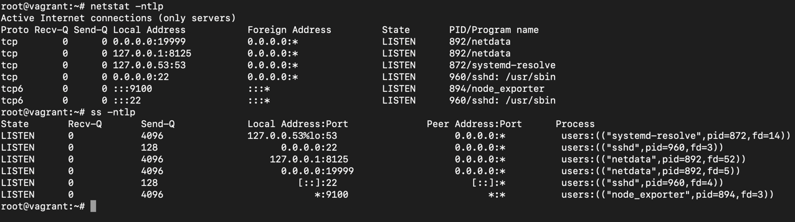
### 4. Проверьте используемые UDP сокеты в Ubuntu, какие протоколы и приложения используют эти порты?
> - 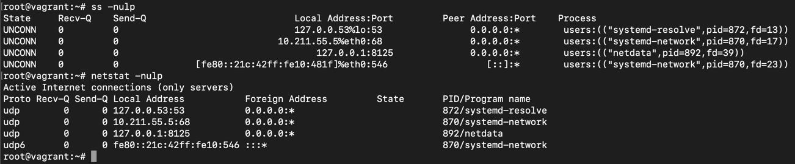
### 5. Используя diagrams.net, создайте L3 диаграмму вашей домашней сети или любой другой сети, с которой вы работали.
> 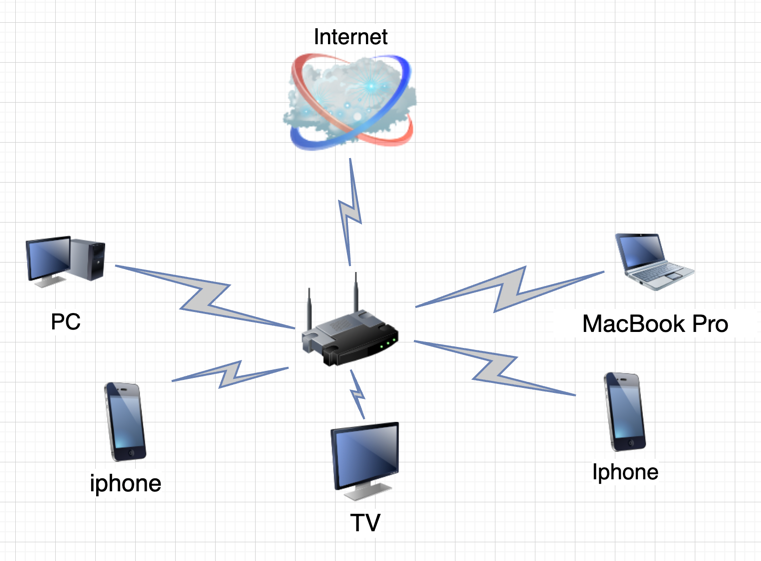
### 6.Установите Nginx, настройте в режиме балансировщика TCP или UDP.
> Вместо виртуальных машин использовал докер  
> 
> 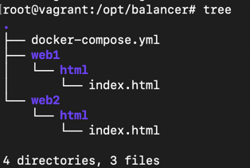  
> 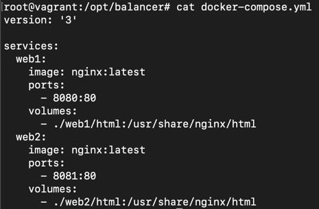
> 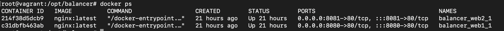
> 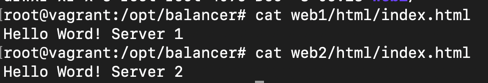  
> 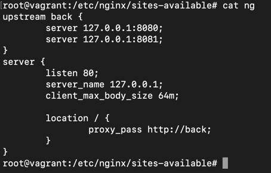  
> 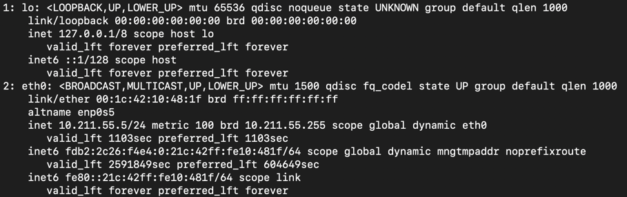  
> 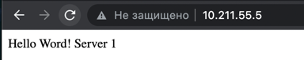
> 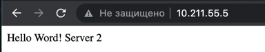
