### 1.Какой системный вызов команды cd? В прошлом ДЗ мы избрали, что cd не является самостоятельным программным обеспечением, shell builtinпоэтому straceсущественно cdне получится. Тем не менее, вы можете играть straceна /bin/bash -c 'cd /tmp'. В этом случае вы видите полный список системных вызовов, которые выполняются сам bashпри старте.Вам нужно найти тот единственный, который относится именно к cd. Обратите внимание, что straceвыдает результат своей работы в потоке stderr, а не в stdout.
> - 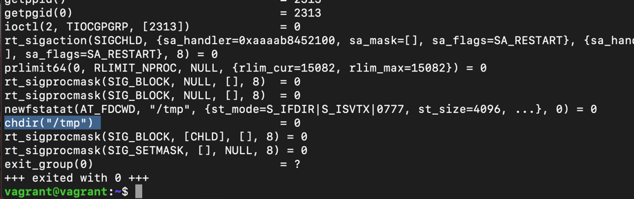
### 2.Попробуйте использовать объекты file разных типов в файловой системе. Например:
vagrant@netology1:~$ file /dev/tty  
vagrant@netology1:~$ file /dev/sda  
vagrant@netology1:~$ file /bin/bash  
Выясните strace, где находится база данных file, на основании которой она делает свои догадки.
> - Пробуем и получаем:
> - 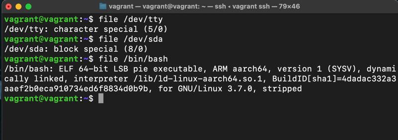
> - 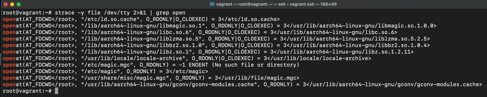
### 3. Приложение пишет журнал в текстовый файл. Этот файл оказался удален (удален в lsof), однако возможность сигналом сказать о наличии переоткрыть файлы или просто перезапустить приложение – нет. Так как приложение продолжает писать в удаленный файл, место на диске постепенно заканчивается. О подтверждении наличия сведений о перенаправлении потоков предлагается способ обнуления открытого удаленного файла (чтобы возникло место нахождения файлов в системе).
> - итак, у нас нет программы пишущей в удаленный файл. для этого имитируем данное действие:   
>1) запустим запись в файл
>- 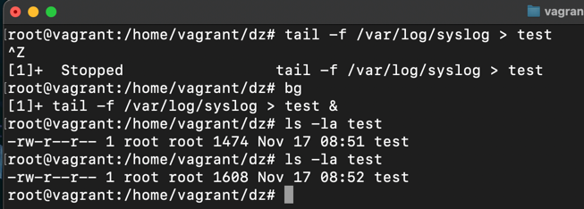
>2) удалим файл и убедимся что он удален
>- 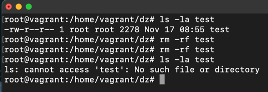
>3) в htop видим что процесс идет, то и tail работает а это значит что запись идет 
> - 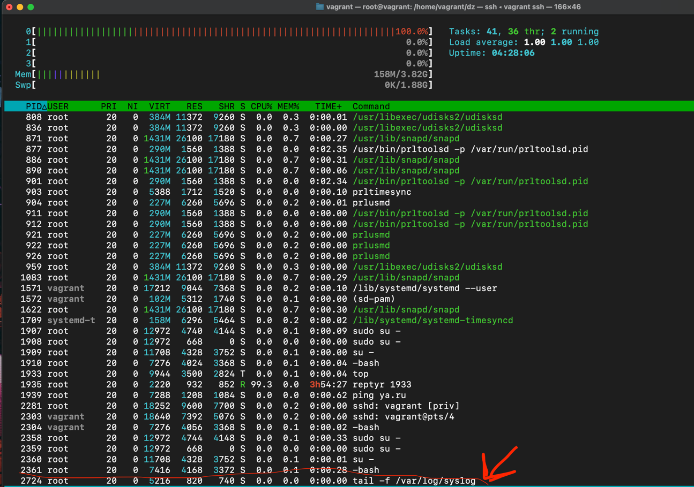
>4) находим наш процесс по пиду и видим что запись в (удаленный) файл продолжается и обьем файла меняется 
> - 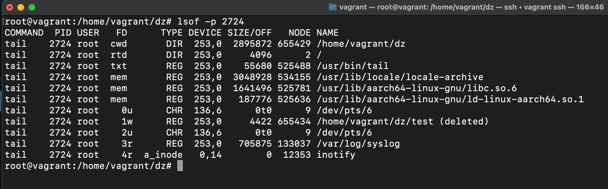
> - 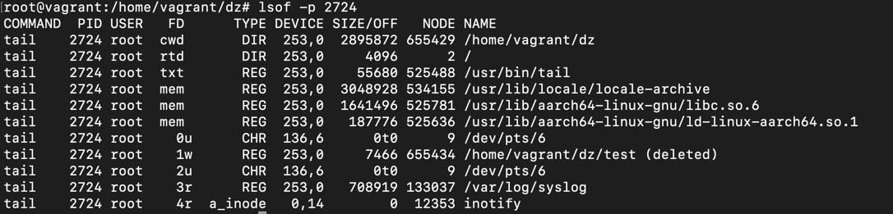
>5) теперь обнулим содержимое файла переписав его  
> - 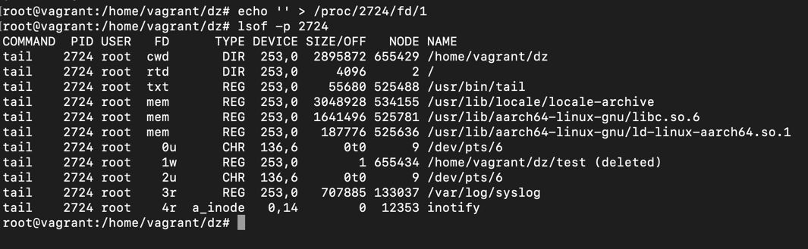  
> - все файл пуст теперь запись начнется сначала
### 4.Занимают ли зомби-процессы какие-то ресурсы в ОС (CPU, RAM, IO)?
> - не занимают
### 5.В iovisor BCC есть утилита opensnoop:
>root@vagrant:~# dpkg -L bpfcc-tools | grep sbin/opensnoop  
>/usr/sbin/opensnoop-bpfcc
> 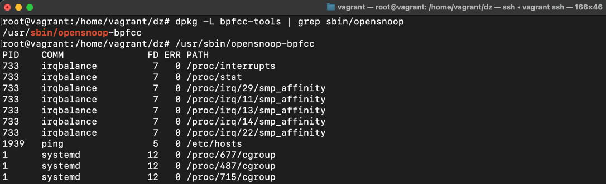
### 6.Какой системный вызов использует uname -a? Приведите цитату из man по этому системному вызову, где описывается альтернативное местоположение в /proc, где можно узнать версию ядра и релиз ОС.
> - uname()
> - cat /proc/version
### 7.Чем отличается последовательность команд через ; и через && в bash? Например:
> root@netology1:~# test -d /tmp/some_dir; echo Hi  
Hi  
root@netology1:~# test -d /tmp/some_dir && echo Hi  
root@netology1:~#  
 Есть ли смысл использовать в bash &&, если применить set -e?  

> - оператор ; выполняет команды последовательно и все,  
> - а &&  будет выполнять вторую команду только в том случае, если первая команда выполнена успешно
> - set -e  останавливает выполнение сценария, если в команде или конвейере есть ошибка
> - смысла использовать в bash &&, если применить set -e как я вижу нет
### 8. Из каких опций состоит режим bash set -euxo pipefail и почему его хорошо было бы использовать в сценариях?
> - e:параметр -e указывает оболочке выйти, если команда дает ненулевой статус выхода. Проще говоря, оболочка завершает работу при сбое команды.
> - u:опция -u обрабатывает неустановленные или неопределенные переменные, за исключением специальных параметров, таких как подстановочные знаки (*) или «@», как ошибки во время раскрытия параметра.
> - -x:опция -x печатает аргументы команды во время выполнения
> - o: опция -о Устаналивает или снимает опцию по её длинному имени. Например set -o noglob. Если никакой опции не задано, то выводится список всех опций и их статус.
> - pipefail: Если установлено, код выхода из конвейера отличается от обычного поведения («последняя команда в конвейере»):  TRUE когда ни одна команда не сработала,  FALSE когда что-то не удалось (код самой правой команды, которая не удалась)
### 9.Используя -o stat для ps, определите, какой наиболее часто встречающийся статус у процессов в системе. В man ps ознакомьтесь (/PROCESS STATE CODES) что значат дополнительные к основной заглавной буквы статуса процессов. Его можно не учитывать при расчете (считать S, Ss или Ssl равнозначными).
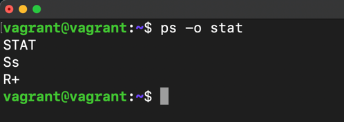  
For BSD formats and when the stat keyword is used, additional characters may be displayed:

               <    high-priority (not nice to other users)
               N    low-priority (nice to other users)
               L    has pages locked into memory (for real-time and custom IO)
               s    is a session leader
               l    is multi-threaded (using CLONE_THREAD, like NPTL pthreads do)
               +    is in the foreground process group
