### 1. Запуск Ubuntu 22.04 в Parallels Desktop с помощью Vagrant: 
> Установка нужных компонентов:
>>-  установил Parallels Desktop
>>-  установил vagrant (brew install vagrant)
>>-  установил плагин: vagrant plugin install vagrant-parallels  

>Инициализация и запуск:  
>> - переходим каталог где хотим хранить конфиг файл vagrant 
>> - выполняем:  
    - vagrant init bento/ubuntu-22.04  
    - vagrant up
  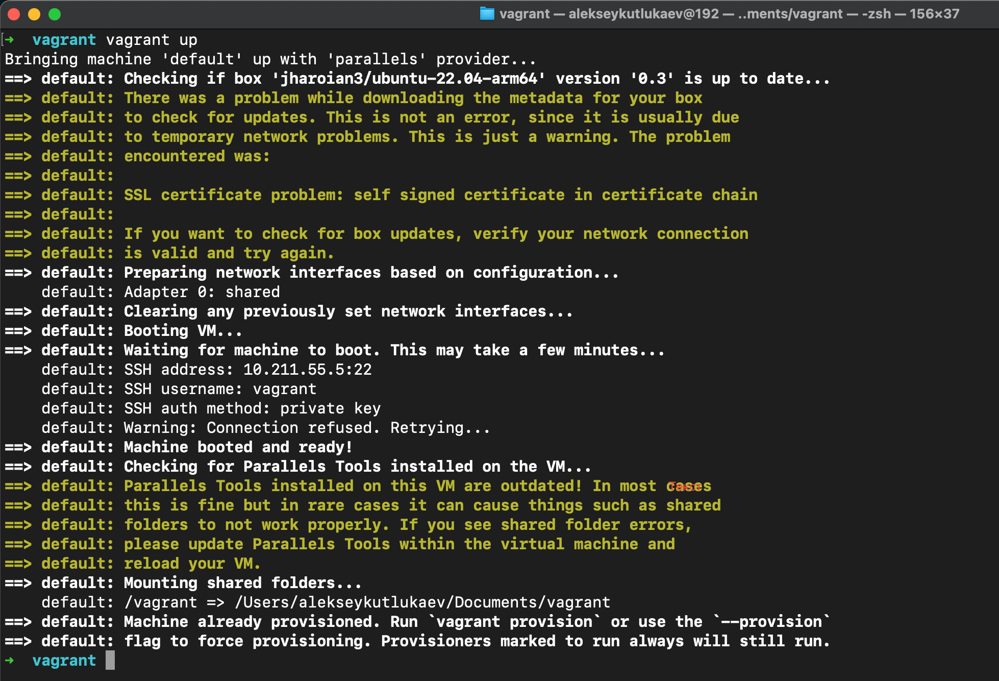
    - vagrant ssh и подключаемся к вм
  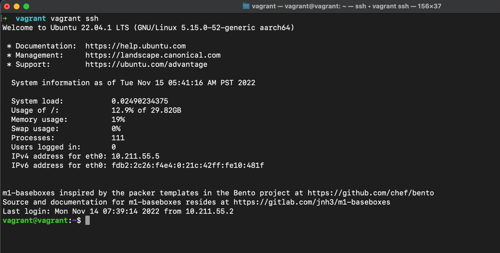
  
### 2. Ознакомьтесь с графическим интерфейсом VirtualBox, посмотрите как выглядит виртуальная машина,которую создал для вас Vagrant, какие аппаратные ресурсы ей выделены. Какие ресурсы выделены по-умолчанию?
> В центре управления появляется вм
>> 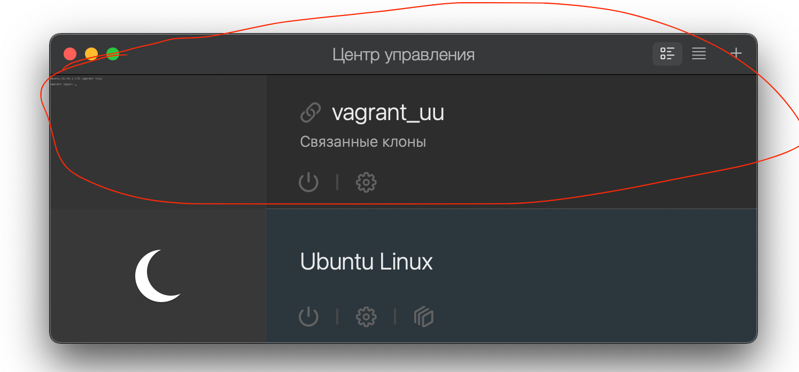
пройдя в настройки можно посмотреть все интересующие характеристики вм  
Например,оперативную память:
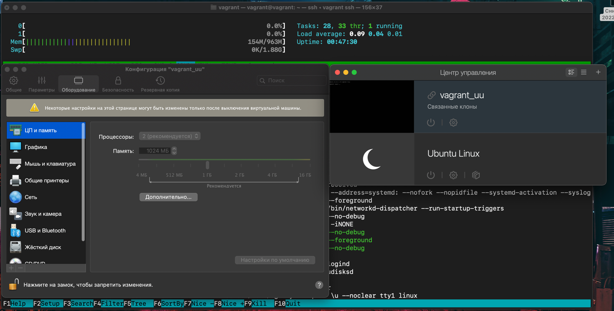

### 3. Ознакомьтесь с возможностями конфигурации VirtualBox через Vagrantfile: документация. Как добавить оперативной памяти или ресурсов процессора виртуальной машине?
>Добавление оперативной памяти и ресурсов прцессора  
>>  - останавливаем виртуальную машину (vagrant halt)
>>  - открываем конфиг файл (nano Vagrantfile)
>>  - в конец добавляем следующие строки  
>>  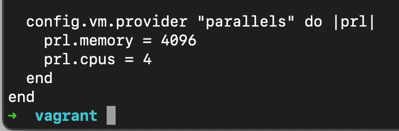
>>  - запускаем vagrant (vagrant up )
>>  - получаем 4гб оперативной памяти и 4 ядра:
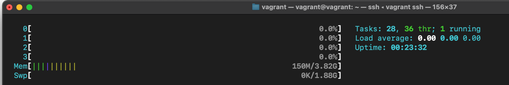  
### 4.Команда vagrant ssh из директории, в которой содержится Vagrantfile, позволит вам оказаться внутри виртуальной машины без каких-либо дополнительных настроек. Попрактикуйтесь в выполнении обсуждаемых команд в терминале Ubuntu.
> Попрактиковался на заданиях №1 и №2
### 5. Ознакомьтесь с разделами man bash, почитайте о настройках самого bash:
> Какой переменной можно задать длину журнала history, и на какой строчке manual это описывается?  
>> - По умолчанию история пишется в файл ~/.bash_history. Определение длины истории можно сконфигурироватьв файле ~/.bashrc
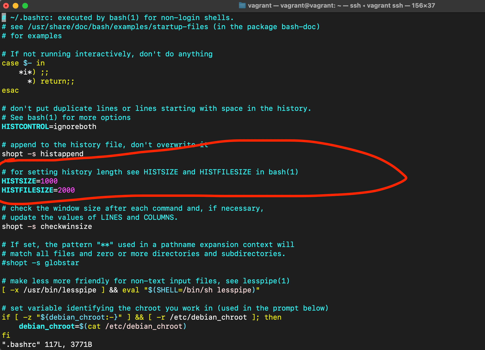
>> - Oписание в маn : man bash > &/hist >  
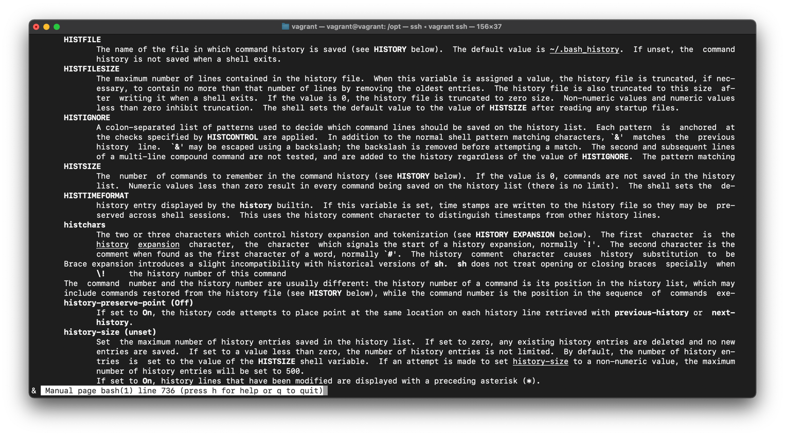  
>> 
> Что делает директива ignoreboth в bash?
>>  ignoreboth это сокращение для 2х директив ignorespace and ignoredups.  
    - ignorespace - не сохранять команды начинающиеся с пробела,   
    - ignoredups - не сохранять команду, если такая уже имеется в истории
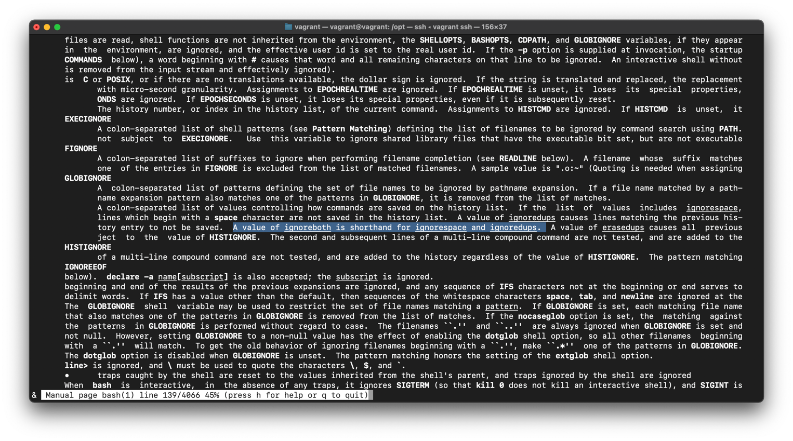
### 6.В каких сценариях использования применимы скобки {} и на какой строчке man bash это описано?
>>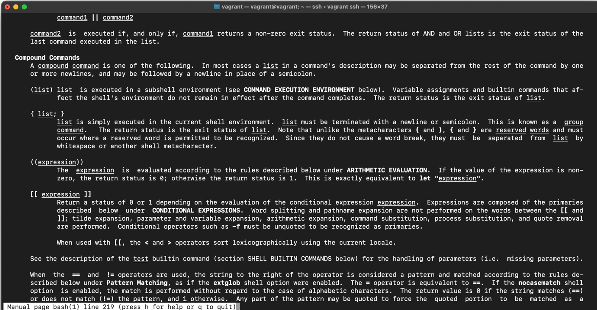 
### 7.С учётом ответа на предыдущий вопрос, как создать однократным вызовом touch 100000 файлов? Получится ли аналогичным образом создать 300000? Если нет, то почему?
>> - touch {000001..100000}.txt
>> - touch {000001..300000}.txt не выполнит ввиду того что список аргументов слишком длинный  
### 8.В man bash поищите по /\[\[. Что делает конструкция [[ -d /tmp ]]  
> - [[ ]] - Возвращает ее статус (0 или 1)
>> 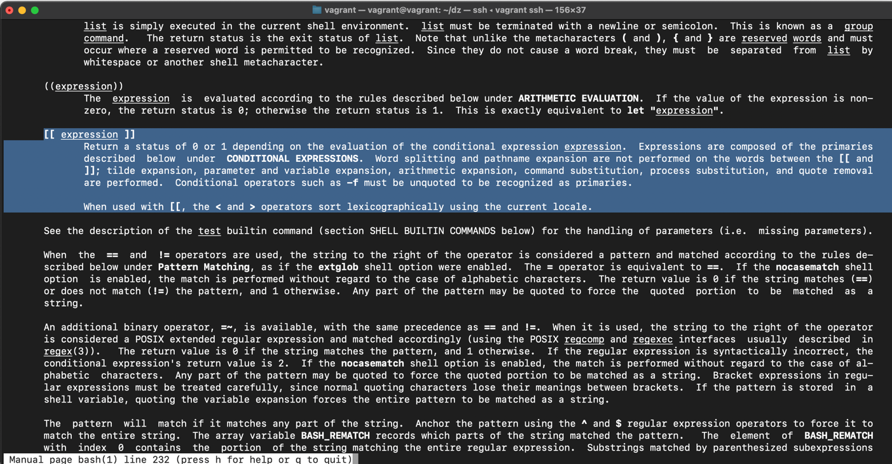  
> 
> - Конструкция [[ -d /tmp ]] проверяет наличие каталога 
### 9. Сделайте так, чтобы в выводе команды type -a bash первым стояла запись с нестандартным путем, например bash is ... Используйте знания о просмотре существующих и создании новых переменных окружения, обратите внимание на переменную окружения PATH

bash is /tmp/new_path_directory/bash  
bash is /usr/local/bin/bash  
bash is /bin/bash  

(прочие строки могут отличаться содержимым и порядком) В качестве ответа приведите команды, которые позволили вам добиться указанного вывода или соответствующие скриншоты.
> выполним type -a bash  
>> видим:  
>> bash is /usr/bin/bash  
>> bash is /bin/bash     

> добавим:  
>> mkdir /tmp/new_path_directory/  
>> cp /bin/bash /tmp/new_path_directory/  
>> PATH=/tmp/new_path_directory/:$PATH

> вводим type -a bash  
>>Получим:  
bash is /tmp/new_path_directory/bash  
bash is /usr/bin/bash  
bash is /bin/bash
> 
### 10. Чем отличается планирование команд с помощью batch и at?
>> at - команда запускается в указанное время (в параметре)  
>> batch - запускается когда уровень средней загрузки системы снизится ниже 1,5

### 11.Завершите работу виртуальной машины чтобы не расходовать ресурсы компьютера и/или батарею ноутбука.
 >> vagrant halt