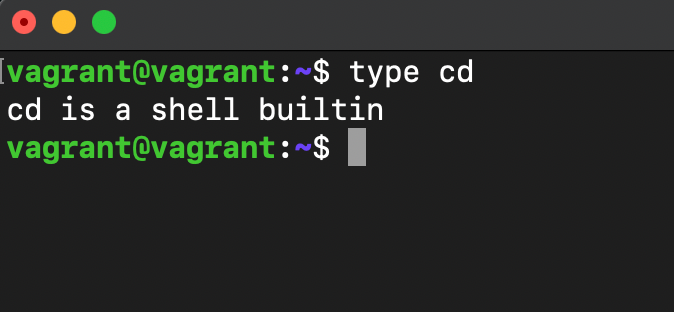
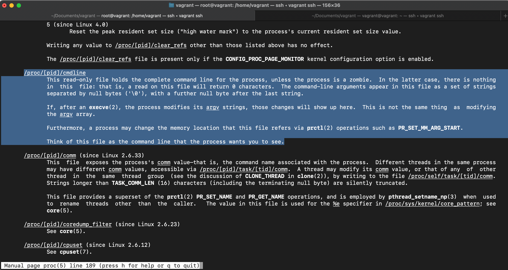

### 1. Какого типа команда cd? Попробуйте объяснить, почему она именно такого типа: опишите ход своих мыслей, если считаете, что она могла бы быть другого типа.
> - cd это встроенная оболочка
> -   
> - она внутрення наверно потому что так удобней:-D.
### 2.Какая альтернатива без pipe команде grep <some_string> <some_file> | wc -l?
> - grep -c   
>   
> 
> - 
### 3. Какой процесс с PID 1 является родителем для всех процессов в вашей виртуальной машине Ubuntu 20.04?
> - 
### 4. Как будет выглядеть команда, которая перенаправит вывод stderr ls на другую сессию терминала?
> - ls 2> /dev/pts/<номер другого терминала>
> - 
> - 
### 5. Получится ли одновременно передать команде файл на stdin и вывести ее stdout в другой файл? Приведите работающий пример.
> - cat < file1> file2
### 6.Получится ли, находясь в графическом режиме, вывести данные из PTY в какой-либо из эмуляторов TTY? Сможете ли вы наблюдать выводимые данные?
> - В задании №4 есть скриншот иллюстрации выполнения 
### 7. Выполните команду bash 5>&1. К чему она приведет? Что будет, если вы выполните echo netology > /proc/$$/fd/5? Почему так происходит?
> - bash 5>&1 создает дескриптор 5 и перенаправляет из него в дескриптор 1, то есть на вывод на экран 

> - echo netology > /proc/$$/fd/5 - запишет в дескриптор 5 значение "netology"  
> а так как дескриптор 5 перенаправлен в stdout на экран выведется netology

### 8. Получится ли в качестве входного потока для pipe использовать только stderr команды, не потеряв при этом отображение stdout на pty? Напоминаем: по умолчанию через pipe передается только stdout команды слева от | на stdin команды справа.Это можно сделать, поменяв стандартные потоки местами через промежуточный новый дескриптор, который вы научились создавать в предыдущем вопросе.
> - ls -l /ss 5>&2 2>&1 1>&5 | grep dir
### 9. Что выведет команда cat /proc/$$/environ? Как еще можно получить аналогичный по содержанию вывод?
> - Выведет переменные окружения 
> - Равносильная команда - env 
### 10. Используя man, опишите что доступно по адресам /proc/< PID >/cmdline, /proc/< PID >/exe
> - / proc / [pid] / cmdline - это файл только для чтения, который содержит полную информацию о процессе из командной строки.
> 
> 
> 
> - / proc / [pid] / exe - это символическая ссылка на фактически работающую программу  
> - 

### 11. Узнайте, какую наиболее старшую версию набора инструкций SSE поддерживает ваш процессор с помощью /proc/cpuinfo
> - cat /proc/cpuinfo | grep SSE
> - grep SSE /proc/cpuinfo 
> - у меня вывод на экран пустой :(

### 12. При открытии нового окна терминала и vagrant ssh создается новая сессия и выделяется pty.
Это можно подтвердить командой tty, которая упоминалась в лекции 3.2.  
Однако:  
vagrant@netology1:~$ ssh localhost 'tty'
not a tty  
Почитайте, почему так происходит, и как изменить поведение.
> - Нужно добавить ключ -t который должен создать псевдотерминал 
> - ssh -t localhost 'tty'
### 13. Бывает, что есть необходимость переместить запущенный процесс из одной сессии в другую. Попробуйте сделать это, воспользовавшись reptyr. Например, так можно перенести в screen процесс, который вы запустили по ошибке в обычной SSH-сессии.
> - 
> - преходим во второй терминал и выполняем 
> - reptyr 1924 и получаем наш htop
### 14. sudo echo string > /root/new_file не даст выполнить перенаправление под обычным пользователем, так как перенаправлением занимается процесс shell'а, который запущен без sudo под вашим пользователем. Для решения данной проблемы можно использовать конструкцию echo string | sudo tee /root/new_file. Узнайте? что делает команда tee и почему в отличие от sudo echo команда с sudo tee будет работать.
> - 
> - команда tee делает вывод одновременно и в файл и в stdout.  
> - в данном примере команда получает вывод из stdin,   
перенаправленный через pipe от stdout команды echo  
и так как команда запущена от sudo,  
соотвественно имеет права на запись в файл
> - Ошибка происходит потому что bash запущен от обычного пользователя,  
конечно можно обойти проблему если bash запустить от судо:  
sudo bash -c 'echo текст >> /путь/к/файлу'
