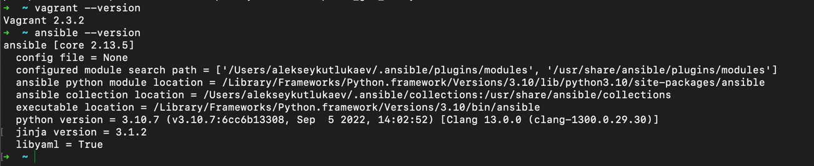

### 1.
> - ### Опишите своими словами основные преимущества применения на практике IaaC паттернов.  
> - ### Какой из принципов IaaC является основополагающим? 

>Ответ:   
Применение на практике IaaC паттернов дает нам возможность автоматизации развертывания инфраструктуры которое в свою очередь ведет к уменьшению трудозатрат. Говоря простым языком если один раз настроить например, плейбук ансибль который устанавливает на сервера докер, то не нужно в будущем руками сидеть и устанавливать на каждом сервере. Так же автоматизация избавляет от возможных ошибок при настройке в ручную.
### 2
> - ### Чем Ansible выгодно отличается от других систем управление конфигурациями?
> - ### Какой, на ваш взгляд, метод работы систем конфигурации более надёжный push или pull?

>Ответ:
> -  На сколько мне известно, что Ansible не надо ничего доустанавливать и для связи с другими серверами достаточно ssh.  
> - думаю pull надежней так как у push есть единая точка отказа.

### 3. Установить на личный компьютер:
> - VirtualBox  
> - Vagrant  
> - Ansible  

