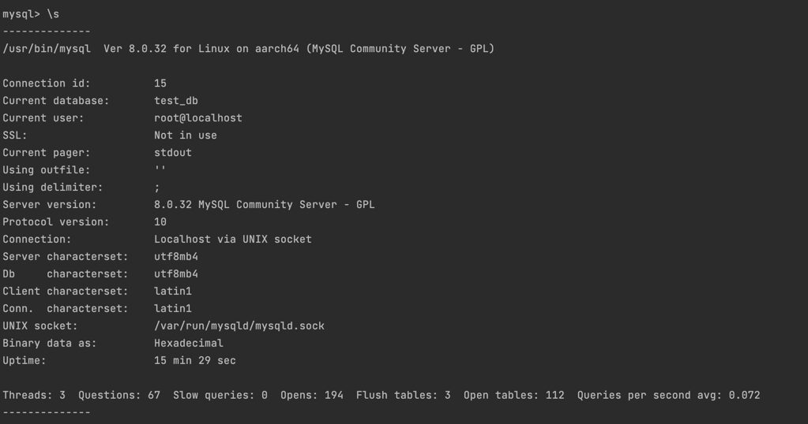
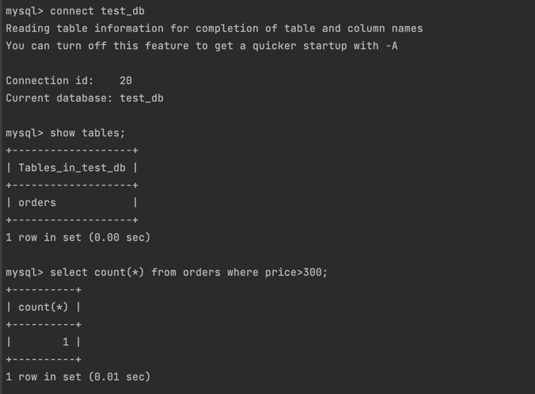
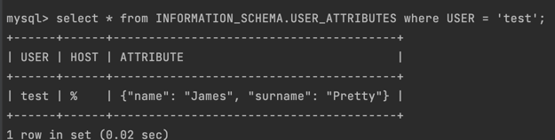
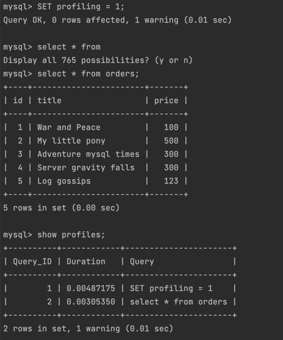
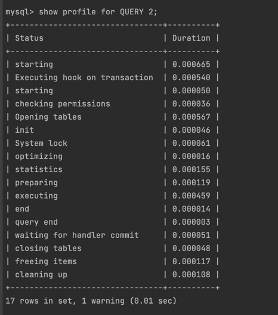
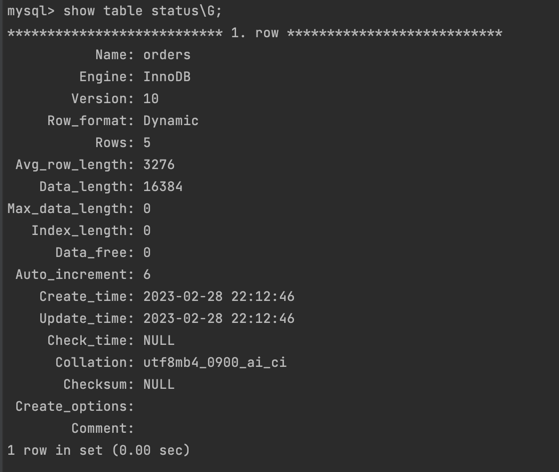
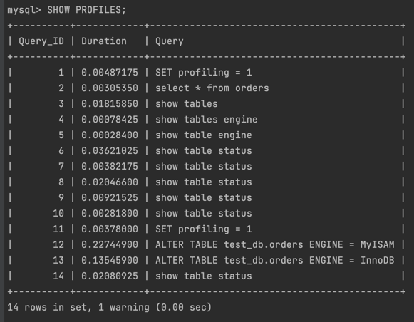
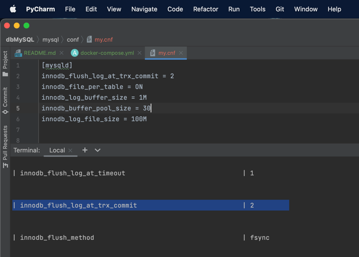

### 1. Задача 1
>Используя Docker, поднимите инстанс MySQL (версию 8).  
> Данные БД сохраните в volume.  s
>Изучите бэкап БД и восстановитесь из него.  
Перейдите в управляющую консоль mysql внутри контейнера.  
Используя команду \h, получите список управляющих команд.  
Найдите команду для выдачи статуса БД и приведите в ответе из её вывода версию сервера БД.  
Подключитесь к восстановленной БД и получите список таблиц из этой БД.  
Приведите в ответе количество записей с price > 300.  
В следующих заданиях мы будем продолжать работу с этим контейнером.

> Решение:
1) поднимаем контейнер
````yml
version: '3'

services:
  mysql:
    container_name: mysql
    image: mysql:8
    environment:
      - MYSQL_ROOT_PASSWORD=admin
    volumes:
      - ./mysql/data:/var/lib/mysql
      - ./mysql/backup:/tmp/backup
    ports:
      - "3306:3306"
````
2) восстанавливаем из бэкапа
> docker exec mysql /usr/bin/mysql -u root --password=admin -e 'CREATE DATABASE test_db;'  

> docker exec -i mysql /usr/bin/mysql -u root --password=admin test_db < mysql/backup/test_dump.sql  
3) Переходим в управляющую консоль внутри контейнера  
> docker exec -it mysql /usr/bin/mysql -u root --password=admin test_db
4) Вывод статистики  

5) Подключимся к востановленной бд и получим список таблиц  


### 2. Задача 2
Создайте пользователя test в БД c паролем test-pass, используя:  
- плагин авторизации mysql_native_password
- срок истечения пароля — 180 дней
- количество попыток авторизации — 3
- максимальное количество запросов в час — 100
- аттрибуты пользователя:  
- - Фамилия "Pretty"  
- - Имя "James".    

Предоставьте привелегии пользователю test на операции SELECT базы test_db.  
Используя таблицу INFORMATION_SCHEMA.USER_ATTRIBUTES, получите данные по пользователю test и приведите в ответе к задаче.

> Решение:  
> 
> - CREATE USER 'test' IDENTIFIED WITH mysql_native_password BY 'testpass' WITH MAX_QUERIES_PER_HOUR 100 PASSWORD EXPIRE INTERVAL 180 DAY FAILED_LOGIN_ATTEMPTS 3 ATTRIBUTE '{"surname": "Pretty", "name": "James"}';   
> 
> 
> - 

### 3. Задача 3
Установите профилирование SET profiling = 1. Изучите вывод профилирования команд SHOW PROFILES;.  
Исследуйте, какой engine используется в таблице БД test_db и приведите в ответе.  
Измените engine и приведите время выполнения и запрос на изменения из профайлера в ответе:  
- на MyISAM,  
- на InnoDB.
> Решение:  
>   
>     
>   
>   

### 4. Задача 4
Изучите файл my.cnf в директории /etc/mysql.  
Измените его согласно ТЗ (движок InnoDB):  
- скорость IO важнее сохранности данных;  
- нужна компрессия таблиц для экономии места на диске;
- размер буффера с незакомиченными транзакциями 1 Мб;
- буффер кеширования 30% от ОЗУ;
- размер файла логов операций 100 Мб.
Приведите в ответе изменённый файл my.cnf.

> Решение:  
> 
```yml
version: '3'

services:
  mysql:
    container_name: mysql
    image: mysql:8
    environment:
      - MYSQL_ROOT_PASSWORD=admin
    volumes:
      - ./mysql/conf/:/etc/mysql/conf.d/
      - ./mysql/data:/var/lib/mysql
      - ./mysql/backup:/tmp/backup
    ports:
      - "3306:3306"


