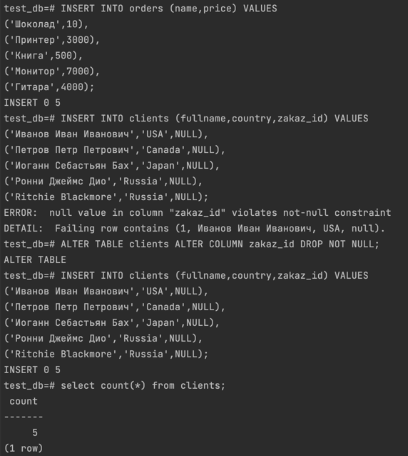

### 1. Задача 1
Используя docker поднимите инстанс PostgreSQL (версию 12) c 2 volume, в который будут складываться данные БД и бэкапы.
Приведите получившуюся команду или docker-compose манифест.
> Решение:
```yml
version: '3'

services:
  postgresql:
    container_name: postgre
    image: postgres:12
    environment:
      POSTGRES_USER: admin
      POSTGRES_PASSWORD: admin
      POSTGRES_DB: test_db
      PGDATA: /data/postgres
    volumes:
       - ./postgres:/data/postgres
       - ./postgresback:/tmp/backup
    ports:
      - "5432:5432"

  pgadmin:
    container_name: pgadmin4_container
    image: dpage/pgadmin4
    restart: always
    environment:
      PGADMIN_DEFAULT_EMAIL: admin@admin.com
      PGADMIN_DEFAULT_PASSWORD: admin
    ports:
      - "5050:80"

```
### 2. Задача 2 
В БД из задачи 1:  
- создайте пользователя test-admin-user и БД test_db
- в БД test_db создайте таблицу orders и clients (спeцификация таблиц ниже)
- предоставьте привилегии на все операции пользователю test-admin-user на таблицы БД test_db
- создайте пользователя test-simple-user
- предоставьте пользователю test-simple-user права на SELECT/INSERT/UPDATE/DELETE данных таблиц БД test_db

Таблица orders:
- id (serial primary key)  
- наименование (string)
- цена (integer)

Таблица clients:  
- id (serial primary key)
- фамилия (string)
- страна проживания (string, index)
- заказ (foreign key orders)

Приведите:  
- итоговый список БД после выполнения пунктов выше,
- описание таблиц (describe)
- SQL-запрос для выдачи списка пользователей с правами над таблицами test_db
- список пользователей с правами над таблицами test_db

> Решение:  


### 3. Задача 3
Используя SQL синтаксис - наполните таблицы следующими тестовыми данными:  

Таблица orders

|Наименование|цена|
|------------|----|
|Шоколад| 10 |
|Принтер| 3000 |
|Книга| 500 |
|Монитор| 7000|
|Гитара| 4000|

Таблица clients

|ФИО|Страна проживания|
|------------|----|
|Иванов Иван Иванович| USA |
|Петров Петр Петрович| Canada |
|Иоганн Себастьян Бах| Japan |
|Ронни Джеймс Дио| Russia|
|Ritchie Blackmore| Russia|

Используя SQL синтаксис:
- вычислите количество записей для каждой таблицы 
- приведите в ответе:
    - запросы 
    - результаты их выполнения.

> Решение:  
> 
### 4. Задача 4

Часть пользователей из таблицы clients решили оформить заказы из таблицы orders.

Используя foreign keys свяжите записи из таблиц, согласно таблице:

|ФИО|Заказ|
|------------|----|
|Иванов Иван Иванович| Книга |
|Петров Петр Петрович| Монитор |
|Иоганн Себастьян Бах| Гитара |

Приведите SQL-запросы для выполнения данных операций.

Приведите SQL-запрос для выдачи всех пользователей, которые совершили заказ, а также вывод данного запроса.
 
Подсказк - используйте директиву `UPDATE`.

> Решение:  
запрос не получился) сделал через pgAdmin
> 
> 
> 
### 5. Задача 5

Получите полную информацию по выполнению запроса выдачи всех пользователей из задачи 4 
(используя директиву EXPLAIN).

Приведите получившийся результат и объясните что значат полученные значения.

> Решение:  
> 
- Seq Scan — означает, что используется последовательное, блок за блоком, чтение данных таблицы clients  
- Cost - некая виртуальная величина призванная оценить затратность операции. Первое значение 0.00 — затраты на получение первой строки. Второе — 18.10 — затраты на получение всех строк.
Единица измерения cost – «извлечение одной страницы в последовательном (sequential) порядке». То есть оценивается и время, и использование ресурсов.  
- rows — приблизительное количество возвращаемых строк при выполнении операции Seq Scan. Это значение возвращает планировщик.
- width - это оценка PostgreSQL того, сколько, в среднем, байт содержится в одной строке, возвращенной в рамках данной операции

### 6. Задача 6
- Создайте бэкап БД test_db и поместите его в volume, предназначенный для бэкапов (см. Задачу 1).  
- Остановите контейнер с PostgreSQL (но не удаляйте volumes).
- Поднимите новый пустой контейнер с PostgreSQL.
- Восстановите БД test_db в новом контейнере.
- Приведите список операций, который вы применяли для бэкапа данных и восстановления.

> Решение:  
> 1) резервируем роли:
>> docker exec -it postgre pg_dumpall -U admin --roles-only -f /tmp/backup/roles.sql
> 2) резервируем базу:
>>docker exec -it postgre pg_dump -h localhost -U admin -F t -f /tmp/backup/test_db.tar test_db
> 3) стопорим докер композ
>> docker-compose down
> 4) запускаем новый контейнер 
>> docker run --name postgre_restored -d -e POSTGRES_USER=admin -e POSTGRES_HOST_AUTH_METHOD=trust -v '/Users/alekseykutlukaev/Documents/devops-netology/virtualization/dbSQL/postgres:/data/postgres' -v '/Users/alekseykutlukaev/Documents/devops-netology/virtualization/dbSQL/postgresback:/tmp/backup' postgres:12 
>- 
> 5) создаем новую базу
>> docker exec -it postgre_restored psql -U admin -c "CREATE DATABASE test_db";
> 6) Востановление ролей и базы
>> docker exec -it postgre_restored psql -U admin -f /tmp/backup/roles.sql  
>> docker exec -it postgre_restored pg_restore -U admin -Ft -v -d test_db /tmp/backup/test_db.tar

> Проверяем и видим что таблицы на месте  
