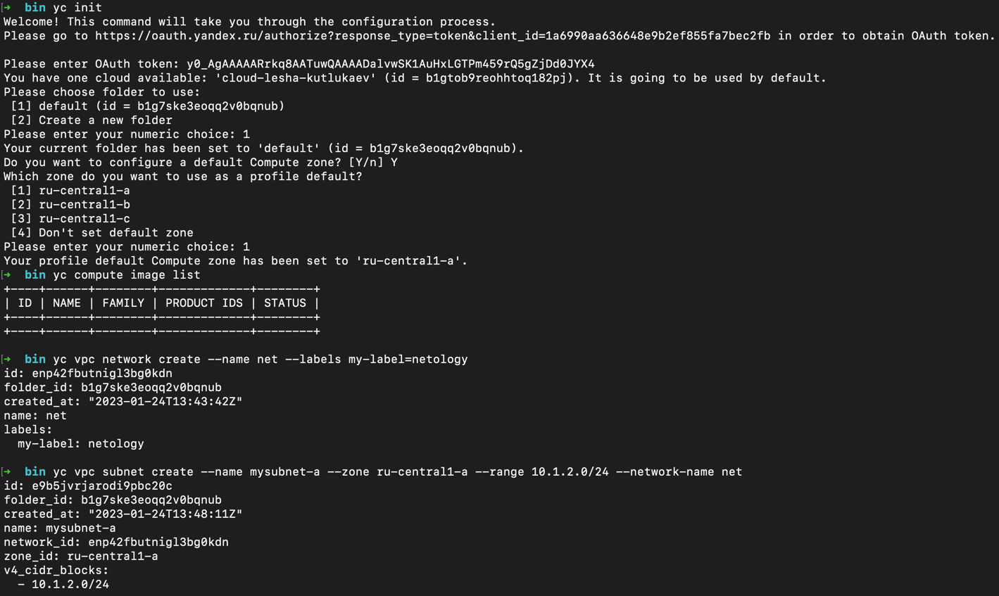
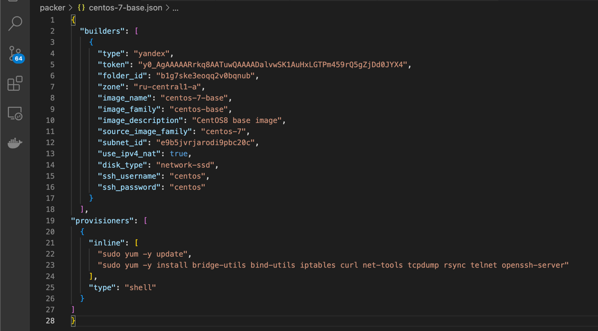
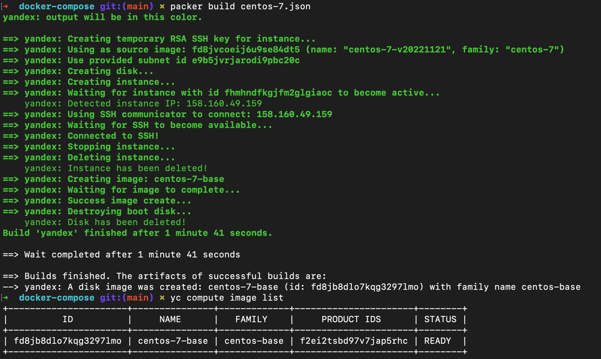
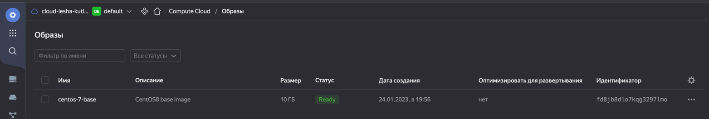
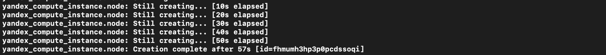
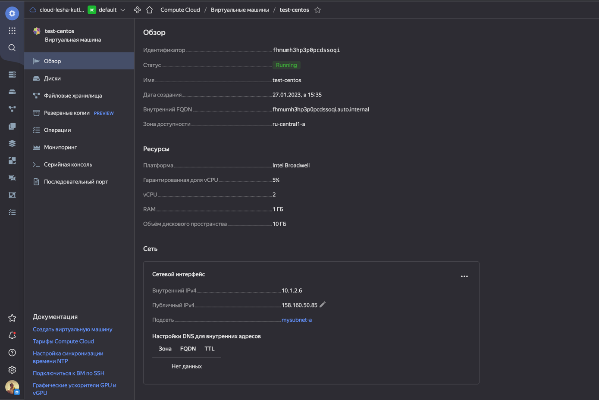
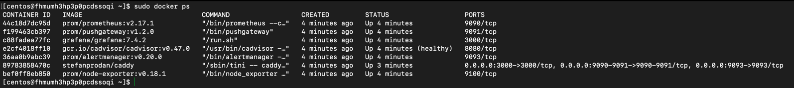
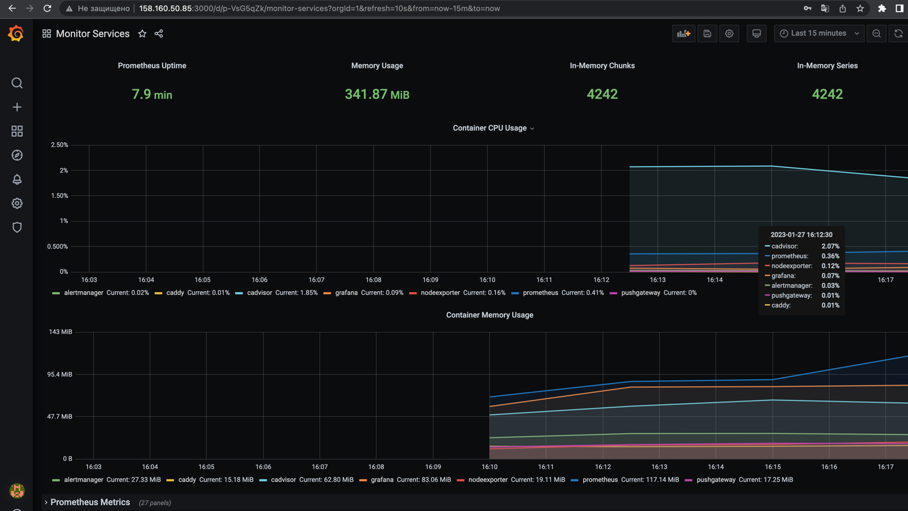

### 1.
> - Создать собственный образ любой операционной системы (например, centos-7) с помощью Packer (инструкция)
> - Для получения зачета вам необходимо предоставить скриншот страницы с созданным образом из личного кабинета YandexCloud.  

> Решение:  

### 2. Создать вашу первую виртуальную машину в YandexCloud с помощью terraform. Используйте terraform код в директории (src/terraform)

Для получения зачета, вам необходимо предоставить вывод команды terraform apply и страницы свойств созданной ВМ из личного кабинета YandexCloud.
> Решение:

> 
> 
### 3. С помощью ansible и docker-compose разверните на виртуальной машине из предыдущего задания систему мониторинга на основе Prometheus/Grafana . Используйте ansible код в директории (src/ansible)

Для получения зачета вам необходимо предоставить вывод команды "docker ps" , все контейнеры, описанные в (docker-compose), должны быть в статусе "Up".
> Решение:
> 

### 4.Создать ваш первый готовый к боевой эксплуатации компонент мониторинга, состоящий из стека микросервисов.

Для получения зачета, вам необходимо предоставить:

Скриншот работающего веб-интерфейса Grafana с текущими метриками, как на примере ниже

>Ответ:
>

