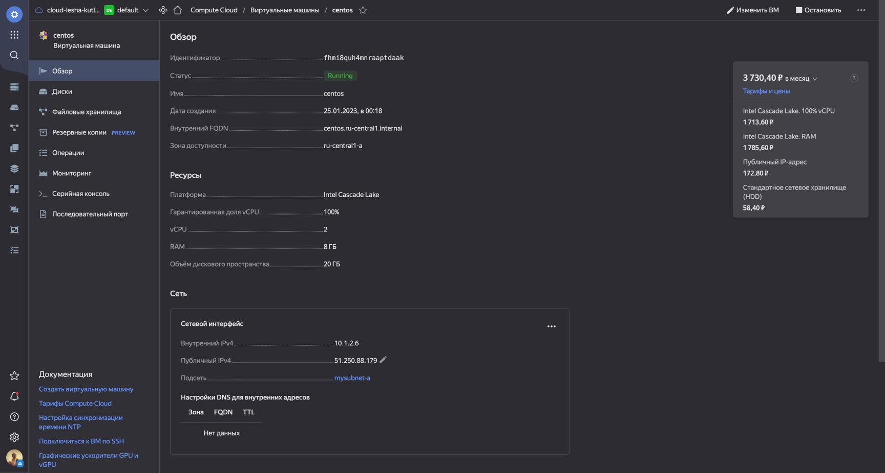

### 1.
> - Создать собственный образ любой операционной системы (например, centos-7) с помощью Packer (инструкция)
> - Для получения зачета вам необходимо предоставить скриншот страницы с созданным образом из личного кабинета YandexCloud.  

> Решение:  


### 2. Создать вашу первую виртуальную машину в YandexCloud.
> Для получения зачета, вам необходимо предоставить cкриншот страницы свойств созданной ВМ из личного кабинета YandexCloud.

> Решение1:  




> Решение2:
> пишем терраформ файл:  
```terraform
terraform {
  required_providers {
    yandex = {
      source = "yandex-cloud/yandex"
    }
  }
}

provider "yandex" {
  token     = "y0_AgAAAAARrkq8AATuwQAAAADalvwSK1AuHxLGTPm459rQ5gZjDd0JYX4" # OAuth-токен яндекса
  cloud_id  = "b1gtob9reohhtoq182pj"
  folder_id = "b1g7ske3eoqq2v0bqnub"
  zone      = "ru-central1-a"
}


data "yandex_compute_image" "ubuntu" {
  family = "ubuntu-2204-lts"
}

data "yandex_vpc_subnet" "default_a" {
  name = "default-ru-central1-a"  
}

resource "yandex_compute_instance" "node" {
  name         = "test-ubuntu"
  platform_id  = "standard-v1" 

  resources {
    core_fraction = 5 # Гарантированная доля vCPU
    cores         = 2 # vCPU
    memory        = 1 # RAM
  }

  boot_disk {
    initialize_params {
      image_id = "fd8c5uabtiabvlcvdr97"
      size = 10 # Размер диска виртуалки
    }
  }

  network_interface {
    subnet_id = "e9b5jvrjarodi9pbc20c"
    nat = true # автоматически установить динамический ip
  }
}
```
>проверяем конфиг на ошибки:  
>>terraform validate  
> 
>выводим список создаваемых ресурсов с параметрами:  
>> terraform plan  
> 
> запускаем создание ресурса: 
>> terraform apply  


