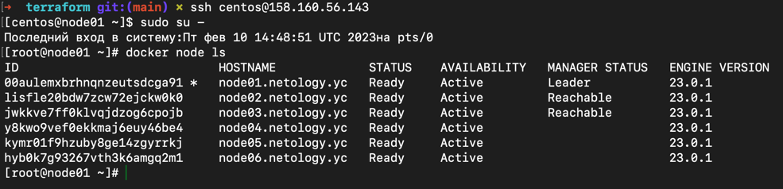
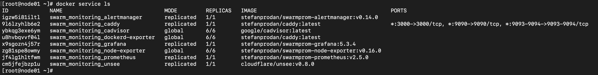

### 1. Задача 1
Дайте письменые ответы на следующие вопросы:

- В чём отличие режимов работы сервисов в Docker Swarm кластере: replication и global?  
- Какой алгоритм выбора лидера используется в Docker Swarm кластере?
Что такое Overlay Network?

> Ответ:
>  
> - Для реплицируемой службы указывается количество идентичных задач, которые необходимо запустить.
Глобальная служба запускает одну задачу на каждом узле. 

> - Для выбора лидера используется алгоритм поддержания распределённого консенсуса - Raft.
Если обычный узел долго не получает сообщений от лидера, то он переходит в состояние «кандидат» и посылает другим узлам запрос на голосование. Другие узлы голосуют за того кандидата, от которого они получили первый запрос. Если кандидат получает сообщение от лидера, то он снимает свою кандидатуру и возвращается в обычное состояние. Если кандидат получает большинство голосов, то он становится лидером. Если же он не получил большинства (это случай, когда на кластере возникли сразу несколько кандидатов и голоса разделились), то кандидат ждёт случайное время и инициирует новую процедуру голосования.
Процедура голосования повторяется, пока не будет выбран лидер.

> - Overlay Network в контексте docker является распределенной сетью между несколькими узлами docker. Эта сеть находится поверх (перекрывает) сети, специфичные для хоста, позволяя контейнерам, подключенным к ней (включая контейнеры службы swarm), безопасно обмениваться данными при включенном шифровании.

### 2. Задача 2
Создать ваш первый Docker Swarm кластер в Яндекс.Облаке
Для получения зачета, вам необходимо предоставить скриншот из терминала (консоли), с выводом команды:
> docker node ls
> 
> 
> 
### 3. Задача 3
Создать ваш первый, готовый к боевой эксплуатации кластер мониторинга, состоящий из стека микросервисов.
Для получения зачета, вам необходимо предоставить скриншот из терминала (консоли), с выводом команды:

> docker service ls
> 
> 
> 