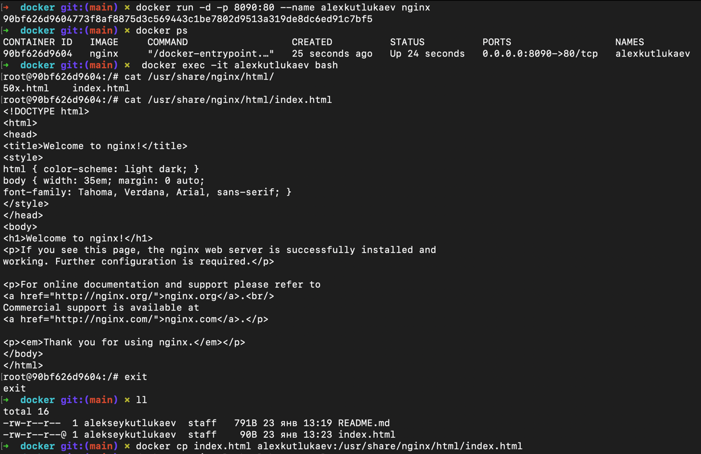
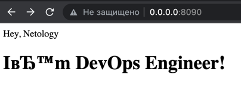
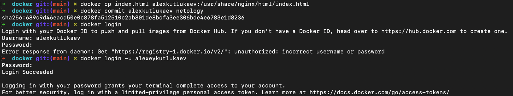
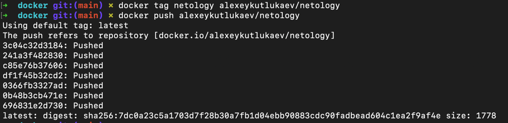
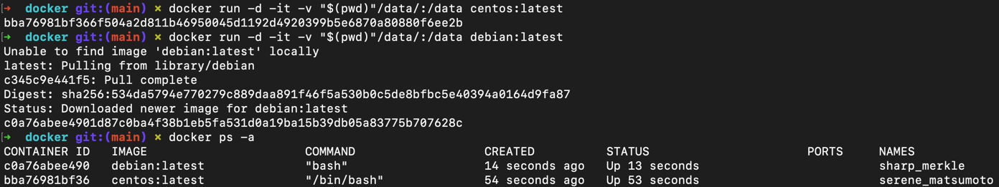
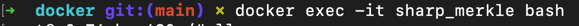
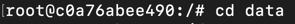
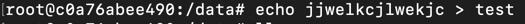
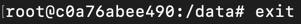
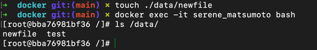

### 1. Сценарий выполения задачи:

- создайте свой репозиторий на https://hub.docker.com;  
- выберете любой образ, который содержит веб-сервер Nginx;  
- создайте свой fork образа;  
- реализуйте функциональность: запуск веб-сервера в фоне с индекс-страницей, содержащей HTML-код ниже:  
```html
<html>
<head>
Hey, Netology
</head>
<body>
<h1>I’m DevOps Engineer!</h1>
</body>
</html>
```
Опубликуйте созданный форк в своем репозитории и предоставьте ответ в виде ссылки на https://hub.docker.com/username_repo.

>Ответ:
 - https://hub.docker.com/repository/docker/alexeykutlukaev/netology/general
> - 
> - 
> - 
> - 
> 
### 2. Посмотрите на сценарий ниже и ответьте на вопрос: "Подходит ли в этом сценарии использование Docker контейнеров или лучше подойдет виртуальная машина, физическая машина? Может быть возможны разные варианты?"

Детально опишите и обоснуйте свой выбор.

--
Сценарий:  
- Высоконагруженное монолитное java веб-приложение;
- Nodejs веб-приложение;
- Мобильное приложение c версиями для Android и iOS;
- Шина данных на базе Apache Kafka;
- Elasticsearch кластер для реализации логирования продуктивного веб-приложения - три ноды elasticsearch, два logstash и две ноды kibana;
- Мониторинг-стек на базе Prometheus и Grafana;
- MongoDB, как основное хранилище данных для java-приложения;
- Gitlab сервер для реализации CI/CD процессов и приватный (закрытый) Docker Registry.

> Ответ:
> - Высоконагруженное монолитное java веб-приложение - Учтя факт, что приложение монолитное его нужно разместить на физической машине. Конечно можно и на вуртуальной машине запустить для удобства при миграции.  
> - Nodejs веб-приложение - так как это веб и не монолит думаю лучше будет контейнеризация
> - Мобильное приложение c версиями для Android и iOS - если учесть тот факт, что контейнеризация не подходит для работы с UI то все остальное кроме него
> - Шина данных на базе Apache Kafka -  Kafka можно развернуть на «голом железе», виртуальных машинах и контейнерах, как локально, так и в облаке.  
> - Elasticsearch кластер для реализации логирования продуктивного веб-приложения - три ноды elasticsearch, два logstash и две ноды kibana - для размещения требуется использование выделенных хостов виртуальных машин и контейнеров
> - Мониторинг-стек на базе Prometheus и Grafana - можно использовать контейнер или виртуальную машину для облегчения развёртывания и масштабирования.
> - MongoDB, как основное хранилище данных для java-приложения - можно использовать все три варианта.
> - Gitlab сервер для реализации CI/CD процессов и приватный (закрытый) Docker Registry - Docker Registry по умолчанию поставляется в контейнере, Gitlab север может быть размещён всеми тремя способами.

### 3. 
> - ### Запустите первый контейнер из образа centos c любым тэгом в фоновом режиме, подключив папку /data из текущей рабочей директории на хостовой машине в /data контейнера;
> - ### Запустите второй контейнер из образа debian в фоновом режиме, подключив папку /data из текущей рабочей директории на хостовой машине в /data контейнера;
> - ### Подключитесь к первому контейнеру с помощью docker exec и создайте текстовый файл любого содержания в /data;
> - ### Добавьте еще один файл в папку /data на хостовой машине;
> - ### Подключитесь во второй контейнер и отобразите листинг и содержание файлов в /data контейнера.

> Ответ:
> - 
> - 
> - 
> - 
> - 
> - 

