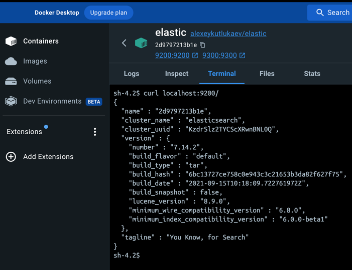

### 1. Задача 1
В этом задании вы потренируетесь в:
- установке Elasticsearch,
- первоначальном конфигурировании Elasticsearch,
- запуске Elasticsearch в Docker.  

Используя Docker-образ centos:7 как базовый и документацию по установке и запуску Elastcisearch:
- составьте Dockerfile-манифест для Elasticsearch,
- соберите Docker-образ и сделайте push в ваш docker.io-репозиторий,
- запустите контейнер из получившегося образа и выполните запрос пути / c хост-машины.

Требования к elasticsearch.yml:
- данные path должны сохраняться в /var/lib,
- имя ноды должно быть netology_test.

В ответе приведите:

- текст Dockerfile-манифеста,
- ссылку на образ в репозитории dockerhub,
- ответ Elasticsearch на запрос пути / в json-виде.

Подсказки:

- возможно, вам понадобится установка пакета perl-Digest-SHA для корректной работы пакета shasum,
- при сетевых проблемах внимательно изучите кластерные и сетевые настройки в elasticsearch.yml,
- при некоторых проблемах вам поможет Docker-директива ulimit,
- Elasticsearch в логах обычно описывает проблему и пути её решения.

> Решение:
```dockerfile
FROM centos:7
EXPOSE 9200 9300
WORKDIR /var/lib
COPY elasticsearch-7.14.2-linux-aarch64.tar.gz $WORKDIR
RUN tar -xzf elasticsearch-7.14.2-linux-aarch64.tar.gz && \
rm -f elasticsearch-7.14.2-linux-aarch64.tar.gz &&\
RUN echo "cluster.name: netology_test" > /elasticsearch-7.14.2/config/elasticsearch.yml && \
echo "node.name: netology_test" >> /elasticsearch-7.14.2/config/elasticsearch.yml && \
echo "path.data: /var/lib" >> /elasticsearch-7.14.2/config/elasticsearch.yml && \
echo "network.host: 0.0.0.0" >> /elasticsearch-7.14.2/config/elasticsearch.yml && \
echo "discovery.type: single-node" >> /elasticsearch-7.14.2/config/elasticsearch.yml && \
useradd -MU elastic && \
chown elastic:elastic -R elasticsearch-7.14.2
USER elastic
CMD ["/bin/bash", "/var/lib/elasticsearch-7.14.2/bin/elasticsearch"]
```
> ссылка на реп https://hub.docker.com/r/alexeykutlukaev/elastic/tags
> 
````
version: "3"

services:
  elasticsearch:
    container_name: elastic
    image: alexeykutlukaev/elastic:latest
    restart: always
    environment:
      - xpack.security.enabled=false
      - discovery.type=single-node
      - node.name=netology_test
      - cluster.name=netology_cluster
    volumes:
      - ./elastic_data:/var/lib/elasticsearch
      - ./elastic_logs:/var/log/elasticsearch/log
    ports:
      - 9200:9200
      - 9300:9300
networks:
  net:
    driver: bridge
````
с локального компьютера недоступно не понял почему  
